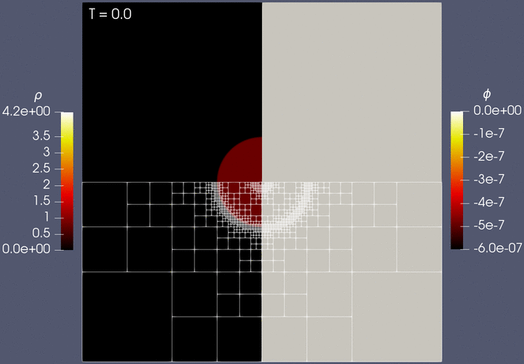

# A purely hyperbolic discontinuous Galerkin approach for self-gravitating gas dynamics

[](https://opensource.org/licenses/MIT)
[](https://doi.org/TODO)

<p align="center">
  
  <br />
  <i>Simulation of self-gravitating Sedov blast wave with adaptive mesh refinement.</i>
</p>


This repository contains information and code to reproduce the results presented in the article
```
@online{schlottkelakemper2020purely,
  title={A purely hyperbolic discontinuous {G}alerkin approach for
         self-gravitating gas dynamics},
  author={Schlottke-Lakemper, Michael and Winters, Andrew R and
          Ranocha, Hendrik and Gassner, Gregor J},
  year={2020},
  month={08},
  eprint={2008.TODO},
  eprinttype={arXiv},
  eprintclass={math.NA}
}
```

If you find these results useful, please cite the article mentioned above. If you
use the implementations provided here, please **also** cite this repository as
```
@misc{schlottkelakemper2020purelyRepro,
  title={{paper-self-gravitating-gas-dynamics}.
         {A} purely hyperbolic discontinuous {G}alerkin approach for
         self-gravitating gas dynamics},
  author={Schlottke-Lakemper, Michael and Winters, Andrew R and
          Ranocha, Hendrik and Gassner, Gregor J},
  year={2020},
  month={08},
  howpublished={\url{https://github.com/trixi-framework/paper-self-gravitating-gas-dynamics}},
  doi={TODO}
}
```


## Abstract

One of the challenges when simulating astrophysical flows with self-gravity is to compute the
gravitational forces. In contrast to the hyperbolic hydrodynamic equations, the gravity field is
described by an elliptic Poisson equation. We present a purely hyperbolic approach by reformulating
the elliptic problem into a hyperbolic diffusion problem, which is solved in pseudotime 
using the same explicit high-order discontinuous Galerkin method we use for the flow solution. The
flow and the gravity solvers operate on a joint hierarchical Cartesian mesh and are two-way coupled
via the source terms. A key benefit of our approach is that it allows the reuse of existing
explicit hyperbolic solvers without modifications, while retaining their advanced features such as
non-conforming and solution-adaptive grids. By updating the gravitational field in each Runge-Kutta
stage of the hydrodynamics solver, high-order convergence is achieved even in coupled multi-physics
simulations. After verifying the expected order of convergence for single-physics and multi-physics
setups, we validate our approach by a simulation of the Jeans gravitational instability.
Furthermore, we demonstrate the full capabilities of our numerical framework by computing a
self-gravitating Sedov blast with shock capturing in the flow solver and adaptive mesh refinement
for the entire coupled system.


## Numerical experiments

The numerical experiments presented in the paper use [Trixi.jl](https://github.com/trixi-framework/Trixi.jl),
a flexible tree-based numerical simulation framework for PDEs written in Julia.
To reproduce the numerical experiments, you need to install [Julia](https://julialang.org/).
Postprocessing some numerical experiments requires Python, Paraview, and MATLAB.

The subfolders of this repository contain README.md files with instructions to reproduce the numerical
experiments, including postprocessing.

The numerical experiments were carried out using Julia v1.5.0.
The MATLAB scripts were executed using MATLAB R2018a.


## Authors

* [Michael Schlottke-Lakemper](https://www.mi.uni-koeln.de/NumSim/schlottke-lakemper) (University of Cologne, Germany)
* [Andrew Winters](https://liu.se/en/employee/andwi94) (Linköping University, Sweden)
* [Hendrik Ranocha](https://ranocha.de) (KAUST, Saudi Arabia)
* [Gregor Gassner](https://www.mi.uni-koeln.de/NumSim/gregor-gassner) (University of Cologne, Germany)


## Disclaimer

Everything is provided as is and without warranty. Use at your own risk!
